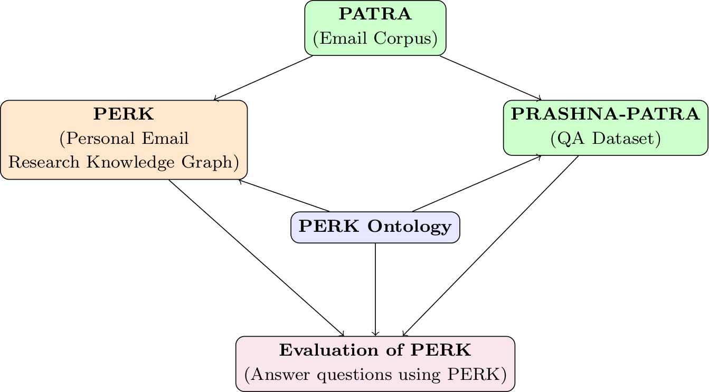
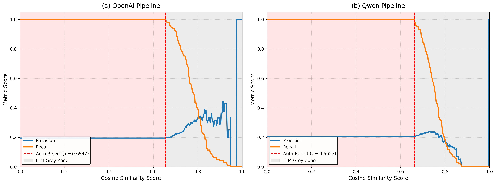
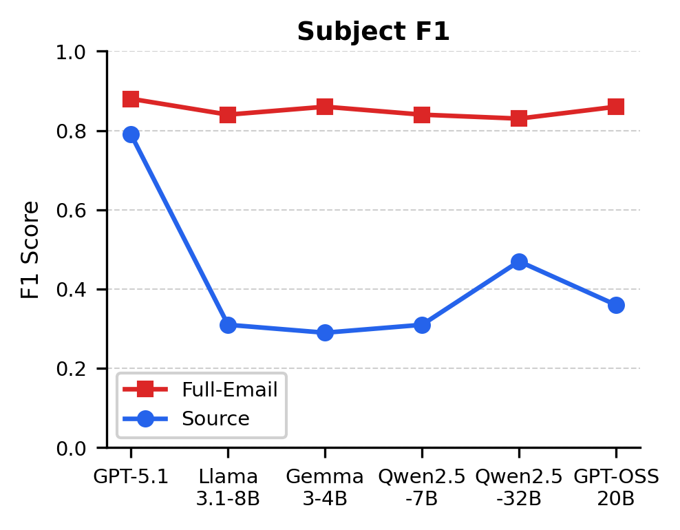
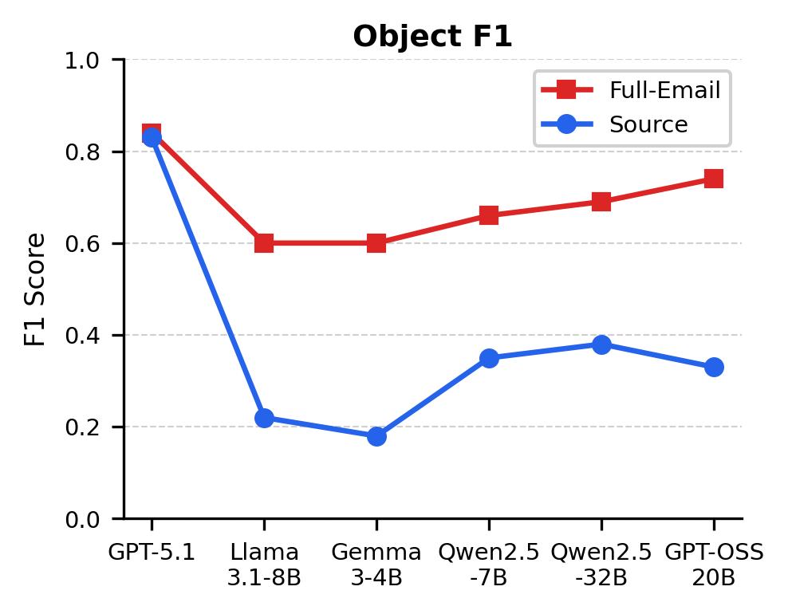
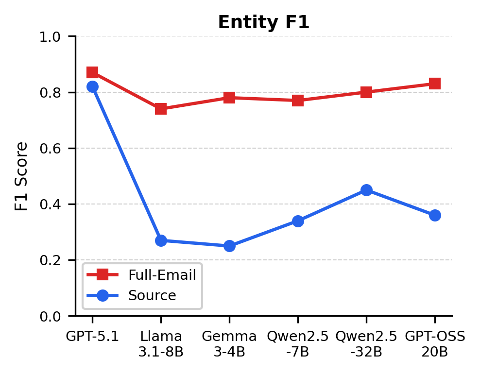
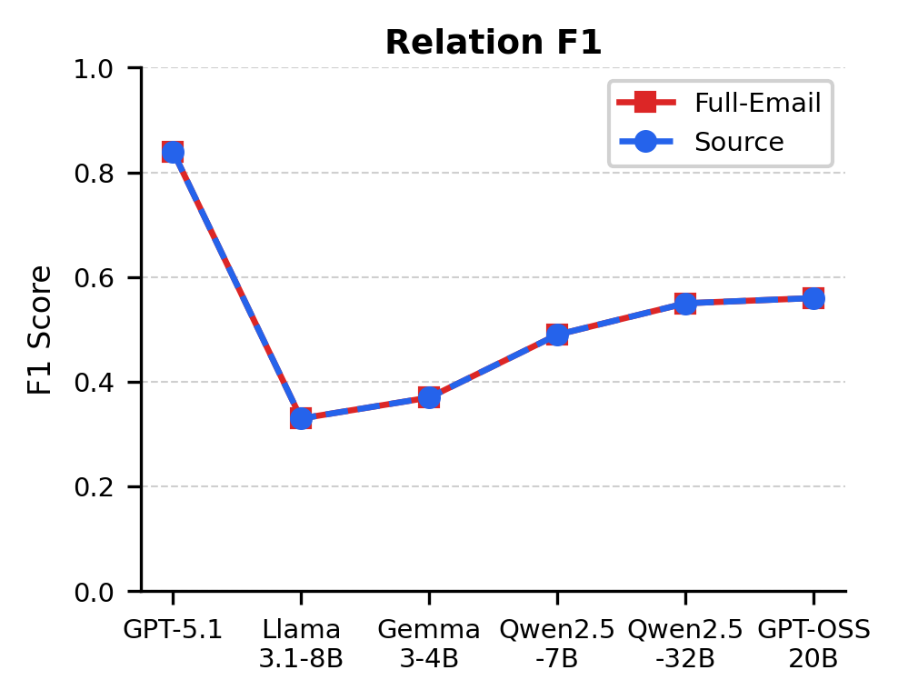
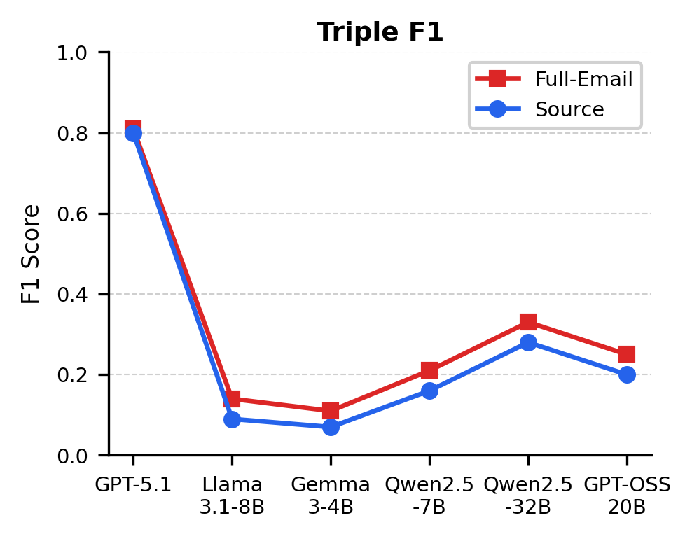
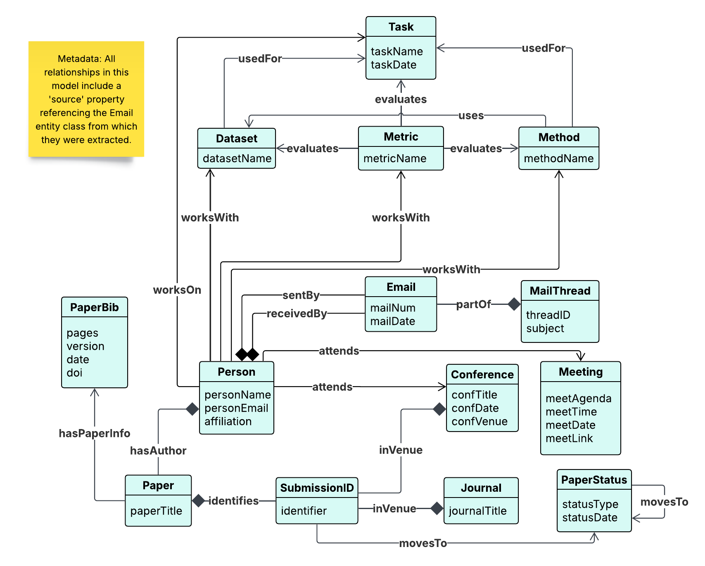

# PERK: Personal Email Research Knowledge Graph

**PERK** is a personal knowledge graph (PKG) that captures the scientific activities of a
researcher — the tasks they work on, the methods and datasets they use, the papers they
write, the venues they submit to, the meetings they attend, and the people they
collaborate with — **as discussed in their academic emails**. The graph is constructed by
LLM-based extraction over email threads and grounded in the **PERKOnto** ontology.

| Resource | Link |
|---|---|
| **Persistent ontology URI** | <https://w3id.org/perkonto> |
| **Dataset / ontology metadata (VoID + DCAT + Dublin Core)** | [`ontology/void.ttl`](ontology/void.ttl) |
| **Archived release (Zenodo)** | <https://doi.org/10.5281/zenodo.20542115> |

---
## 1. Objective



## Repository Structure

```
PERK/
├── datasets/
│   ├── PATRA/                      # Synthetic email corpus
│   ├── PRASHNA_PATRA/              # QA benchmark
│   ├── extraction_gold/            # Annotated triples for extraction evaluation
│   └── neo4j_import/               # Per-type CSVs ready for Neo4j ingestion
├── ontology/
│   ├── PERKOnto.json               # Machine-readable ontology (used by pipeline)
│   ├── PERKOnto.ttl                # Turtle serialisation
│   └── PERKOnto.owx                # OWL/XML serialisation
├── results/
│   ├── entity_resolution/          # ER evaluation logs and error CSVs
│   ├── extractions/                # Per-model extracted entities and relations
│   ├── figures/                    # Generated plots (PDF)
│   └── qa/                         # KG-QA evaluation outputs
└── src/
    ├── prompts/                    # All LLM prompts as plain-text files
    ├── patra_generation/           # Synthetic email generation and preprocessing
    ├── extraction/                 # LLM-based KG extraction
    ├── entity_resolution/          # FAISS blocking, LLM resolution, node fusion
    ├── neo4j/                      # Graph construction and Neo4j ingestion
    └── evaluation/                 # Triple evaluation and KG-QA evaluation
```

---

## Installation

```bash
pip install -r requirements.txt
```

Copy `.env.example` to `.env` and fill in your credentials:

```bash
cp .env.example .env
```

---

## Pipeline

### 1. Dataset Generation

Generate synthetic academic email threads using GPT-4.1:

```bash
python src/patra_generation/generate_patra.py \
    --prompt   src/prompts/patra_gen_prompt.txt \
    --output   datasets/PATRA/PATRA.txt \
    --n_threads 50
```

Preprocess the raw output into clean, delimited email threads:

```bash
python src/patra_generation/preprocess_patra.py \
    --input  datasets/PATRA/PATRA_raw.txt \
    --output datasets/PATRA/PATRA.txt
```

---
### 2. KG Extraction

Extract entities and relations from each email using an LLM. The pipeline supports
OpenAI-compatible APIs and HuggingFace models (run locally).

```bash
# OpenAI API (e.g. GPT-5.1 or GPT-4.1)
python src/extraction/kg_extraction_pipeline.py \
    --model openai --model_path gpt-5.1 \
    --input_file datasets/PATRA/PATRA.txt \
    --output_dir results/extractions/openai/ \
    --prompt_file src/prompts/extraction_prompt.txt
```

**Arguments**

| Flag | Meaning |
|---|---|
| `--model` | Backend: `openai`, `gptoss`, `llama`, `gemma`, `qwen`, `qwen32b` |
| `--model_path` |model ID **or** OpenAI model name (e.g. `gpt-5.1`, `gpt-4.1`, `Qwen/Qwen2.5-7B-Instruct`). Optional for aliases with a default (`gptoss` → `openai/gpt-oss-20b`) |
| `--input_file` | Input corpus in PATRA format |
| `--output_dir` | Output root (`entity_extractions/`, `relation_extractions/`, `final_outputs/`) |
| `--prompt_file` | System prompt (default: `src/prompts/extraction_prompt.txt`) |
| `--gpu` | GPU id for local models |
| `--base_url` | OpenAI-compatible endpoint for a local server (e.g. vLLM/Ollama) |
| `--resume` | Skip emails already processed in `--output_dir` |

The OpenAI path auto-handles the gpt-5 family (which requires the default
temperature); other models use deterministic decoding.

---

### 3. Entity Resolution

Run the full ER pipeline for a given extraction (FAISS blocking → LLM resolution → node fusion → evaluation):

```bash
cd results/extractions/openai/
bash ../../../src/entity_resolution/run_pipeline.sh openai 0.6547
```

**Pipeline steps:**

| Step | Script | Description |
|------|--------|-------------|
| 1 | `faiss_blocking.py` | Semantic candidate blocking with FAISS |
| 2 | `llm_judgement.py` | Qwen2.5-32B match/no-match classification |
| 3 | `node_fusion.py` | Transitive graph fusion + person property patching |
| 4 | `normalize_dates.py` | Date normalisation on fused entities |
| 5 | `evaluate_pipeline.py` | Precision / Recall / F1 against golden set |

**Calibrating the FAISS threshold:**

The auto-reject floor passed to `faiss_blocking.py` / `run_pipeline.sh` is calibrated
from manually annotated candidate pairs (`label` ∈ {`MATCH`, `NO_MATCH`}). For each
similarity cutoff the script sweeps precision/recall and reports the **auto-reject
threshold** (highest score retaining ≥99% recall — pairs below it bypass the LLM and
are auto-rejected) and an **auto-match threshold** (lowest score reaching ≥98%
precision — auto-accepted), if one exists:

```bash
python src/entity_resolution/calibrate_threshold.py \
    --datasets OpenAI=openai_annotated.csv Qwen=qwen32b_annotated.csv \
    --plot_output results/entity_resolution/calibration_plot.png \
    --log_output  results/entity_resolution/calibration_log.txt
```

This reproduces the thresholds used in the paper
([`results/entity_resolution/calibration_log.txt`](results/entity_resolution/calibration_log.txt)):

| Pipeline | Annotated pairs | Auto-reject τ (≥99% recall) | Auto-match (≥98% precision) |
|---|---|---|---|
| **OpenAI** (GPT-5.1) | 497 | **0.6547** | — none reaches 98% precision |
| **Qwen** (32B) | 499 | **0.6627** | — none reaches 98% precision |

No auto-match band exists for either pipeline: no similarity cutoff is precise enough
to safely auto-accept, so every above-floor pair (the "grey zone") is routed to the
Qwen2.5-32B LLM judge. The precision/recall curves and these thresholds are shown below.




**Reported results (ISWC submission):**

| Model | Precision | Recall | F1 |
|-------|-----------|--------|----|
| OpenAI | 0.6538 | 0.5730 | 0.6108 |

---

### 4. Neo4j Graph Construction

**Validate** entities and relations against PERKOnto:

```bash
python src/neo4j/clean_kg.py \
    --entities_in  openai_entities_fused_normdates.csv \
    --relations_in openai_relations_fused.csv \
    --entities_out openai_entities_clean.csv \
    --relations_out openai_relations_clean.csv \
    --ontology     ontology/PERKOnto.json
```

**Split** into per-type CSVs for Neo4j ingestion:

```bash
python src/neo4j/prepare_import.py \
    --entities  openai_entities_clean.csv \
    --relations openai_relations_clean.csv \
    --output    datasets/neo4j_import/
```

**Build** the graph:

```bash
python src/neo4j/build_perk.py \
    --data_dir datasets/neo4j_import/ \
    --ontology ontology/PERKOnto.json
```

**Wipe** the graph (before reimport):

```bash
python src/neo4j/wipe_kg.py --dry-run   # preview node count
python src/neo4j/wipe_kg.py             # delete all nodes and relationships
```

Credentials are read from `NEO4J_URI`, `NEO4J_USERNAME`, `NEO4J_PASSWORD` in `.env`, or passed as `--uri`, `--user`, `--password`.

---

### 5. Evaluation

#### Extraction Evaluation (Sentence-BERT triple metrics)

The golden set is built once by sampling emails and annotating the candidate
triples:

```bash
python src/evaluation/sample_for_annotation.py \
    --entities  results/extractions/openai/entities_final.csv \
    --relations results/extractions/openai/relations_final.csv \
    --emails    datasets/PATRA/PATRA.txt \
    --output    datasets/extraction_gold/golden_set_candidates.csv \
    --n_emails  250
# annotate -> datasets/extraction_gold/refined_golden_set_target.csv
```

For each model, build its `comparison_triples.csv` (resolves entity ids to
label + type, attaches the extracted evidence sentence, and keeps only the
gold-annotated emails):

```bash
python src/evaluation/build_comparison_triples.py \
    --entities  results/extractions/gptoss/final_outputs/entities_final.csv \
    --relations results/extractions/gptoss/final_outputs/relations_final.csv \
    --output    results/extractions/gptoss/evaluation_triples/comparison_triples.csv \
    --source_type GptOss
```

Evaluate with Sentence-BERT — Subject / Object / Entity / Relation / Triple
micro P/R/F1 at τ=0.80, for both the source-sentence and full-email context
(per-context logs over the full τ sweep are written to `results/evaluation/`):

```bash
python src/evaluation/evaluate_llm_triples.py \
    --name GptOss \
    --pred results/extractions/gptoss/evaluation_triples/comparison_triples.csv \
    --tau  0.80 --gpu 0
```

Generate result plots (saved to `results/figures/extractions/`):

```bash
python src/evaluation/plot_results.py
```
Extraction quality across models (micro-F1 at τ = 0.80; **Source** = the source
sentence as context, **Full-Email** = the whole email as context):

|  |  |  |
|:---:|:---:|:---:|
| **Subject F1**<br> | **Object F1**<br> | **Entity F1**<br> |
| **Relation F1**<br> | **Triple F1**<br> |  |

#### KG-QA Evaluation (PRASHNA-PATRA)

```bash
python src/evaluation/kg_eval.py \
    --model   gpt \
    --input   datasets/PRASHNA_PATRA/PRASHNA_PATRA.csv \
    --ontology ontology/PERKOnto.json
```

The `--model` flag selects which Neo4j instance to query via the corresponding env var prefix (e.g. `--model gpt` reads `GPT_NEO4J_URI`).

---
## Ontology

PERKOnto defines 14 node types and 14 relationship types covering the research collaboration domain. The machine-readable `ontology/PERKOnto.json` is used at runtime for:
- Ontology validation during KG cleaning (`clean_kg.py`)
- Schema-guided Cypher generation (`kg_eval.py`)
- Relationship ingestion during graph construction (`build_perk.py`)

Full ontology files (OWL, Turtle) are in `ontology/`.

### Domain extensions
PERKOnto generalizes beyond the academic emails of an NLP scientist to other research domains.
`ontology/ontologies-for-other-fields/` contains three illustrative extensions
that import PERKOnto: `perkonto_chem.ttl` (chemistry), `perkonto_grav.ttl`
(gravitational physics), and `perkonto_molbio.ttl` (molecular biology).




---
### Citation
Chakraborty, P., Sanyal, D. K., Majumdar, S., & Das, P. P. (2026). prantikaC/PERK: PERK (v1.0.0). Zenodo. https://doi.org/10.5281/zenodo.20542115
