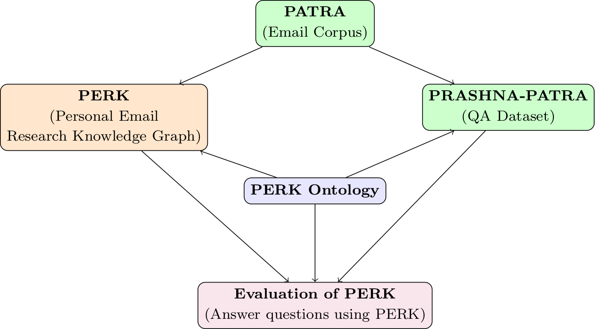
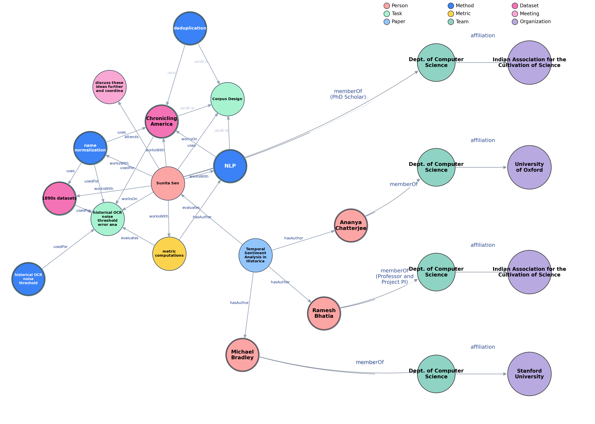
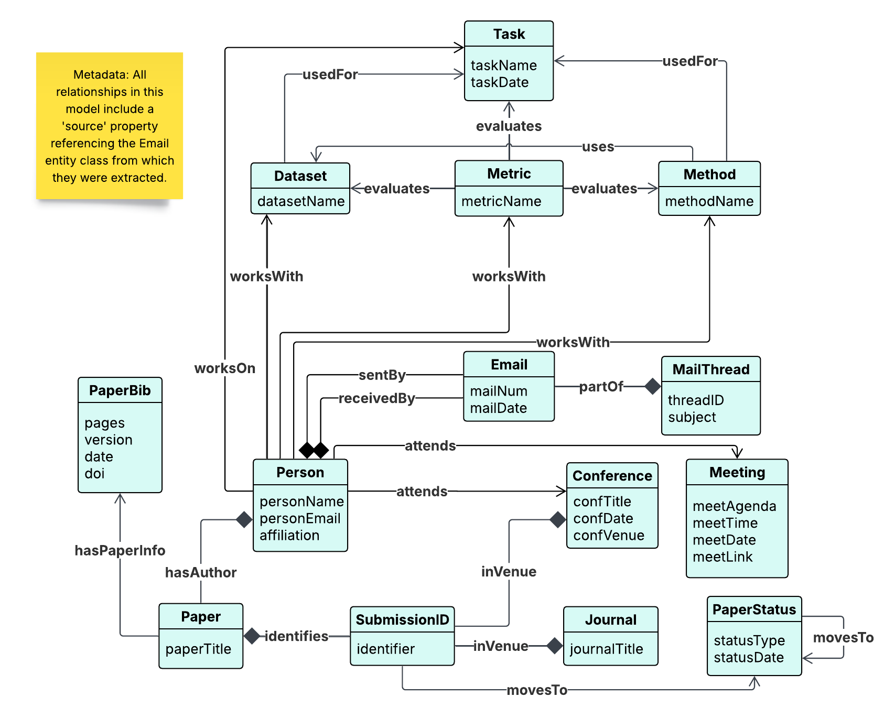

# PERK: Personal Email Research Knowledge Graph

**PERK** is a personal knowledge graph (PKG) that captures the scientific activities of a
researcher — the tasks they work on, the methods and datasets they use, the papers they
write, the venues they submit to, the meetings they attend, and the people they
collaborate with — **as discussed in their academic emails**. The graph is constructed by
LLM-based extraction over email threads and grounded in the **PERKOnto** ontology.

| Resource | Link |
|---|---|
| **Persistent ontology URI** | <https://w3id.org/perkonto> |
| **Dataset / ontology metadata (VoID + DCAT + Dublin Core)** | [`ontology/void.ttl`](ontology/void.ttl) |
| **Archived release (Zenodo, all versions)** | withheld for double-blind review |
---
## Overview

<p align="center">
  
  &nbsp;&nbsp;
  
</p>
<p align="center"><sub><b>Fig 1. (Left)</b> Resource overview. &nbsp; <b>Fig 2. (Right)</b> A snapshot of PERK.</sub></p>

Most knowledge graphs are built from public sources such as papers or the web. PERK
instead models a researcher's **own** scientific life as recorded in their inbox —
including in-progress work that may never appear in any publication. The goal is a
queryable personal graph that lets **autonomous agents answer questions and make
recommendations** over a researcher's activities (e.g. *"Which of my papers were under
review in 2019?"*, *"What meetings did I attend about the PKG project and what were the
agendas?"*).

## Motivation
This resource was motivated by a survey of researchers at our institute, which showed strong interest in personal research KGs (citation withheld for double-blind review). 

## Resources
The repository provides:

- **PATRA** — a corpus of 1,007 synthetic academic email threads.
- **PERKOnto** — the ontology (17 entity classes, 17 object properties) grounding the graph.
- **PRASHNA-PATRA** — a KG-QA benchmark (100 question/answer pairs with Cypher).
- An **annotated gold set** of 2,423 triples for extraction evaluation.
- The full **construction + evaluation pipeline**: extraction → entity resolution →
  Neo4j graph build → triple & QA evaluation.
- Two independently constructed KG instances, **PERK-GPT** (GPT-5.1 extraction) and
  **PERK-Qwen** (open-weight Qwen2.5-32B-Instruct extraction), sharing the same
  Qwen2.5-32B-Instruct entity-resolution classifier.

## Workflow
- The corpus of emails (PATRA) is first constructed/curated. Currently, the synthetic dataset is created by prompting an LLM. However, it requires post-processing to ensure that the corpus does not contain hallucinations and other errors (e.g., temporal inconsistencies).
- An ontology (PERKOnto) is then designed, capturing the entities and relations of interest.
- The PKG (PERK) is built by extracting triples from the email corpus conforming to ontological constraints. Currently, triples are extracted by prompting LLMs; the method does not guarantee perfect noise-free extraction.
- QA dataset (PRASHNA-PATRA) is built using the email corpus and the ontology (to restrict to ontology-specified entities and relations).

## PERKOnto

PERKOnto defines **17 OWL classes** and **17 OWL object properties**, in four clusters:
Communication Infrastructure (`Email`, `MailThread`, `EmailID`), Researchers and Venues
(`Person`, `Team`, `Organization`, `Conference`, `Journal`), Publication Lifecycle (`Paper`,
`PaperBib`, `SubmissionID`, `PaperStatus`), and Research Content (`Dataset`, `Method`,
`Task`, `Metric`, `Meeting`). Every object property carries a `source` datatype property
recording the email a triple was extracted from. The machine-readable
[`ontology/PERKOnto.json`](ontology/PERKOnto.json) is used at runtime for ontology
validation during KG cleaning (`clean_kg.py`) and relationship ingestion during graph
construction (`build_perk.py`). Full serialisations (OWL, Turtle, RDF/XML, JSON-LD,
OWL/XML, N-Triples) are in [`ontology/`](ontology/).

**Generalising beyond NLP.** PERKOnto is domain-adaptable: the four NLP-specific classes
(`Task`, `Method`, `Metric`, `Dataset`) can be swapped for domain-specific ones while the
rest of the schema (people, emails, papers, venues, meetings, statuses) is reused. Three
example domain ontologies are included under
[`ontology/ontologies-for-other-fields/`](ontology/ontologies-for-other-fields/):

| Domain | Replacement classes |
|---|---|
| Computational chemistry | ResearchProblem, ComputationalMethod, Observable, ChemicalSystem |
| Gravitational physics | ResearchProblem, AnalysisMethod, PhysicalParameter, AstrophysicalSource, ObservationalData |
| Molecular biology | ResearchProblem, ExperimentalTechnique, Readout, BiologicalEntity, BiologicalSample |

<p align="center">
  
</p>
<p align="center"><sub><b>Fig 3.</b> The PERKOnto schema — 17 entity classes (nodes) and 17 relationship types (edges) modelling research collaboration in academic email.</sub></p>

The resource is actively maintained, with planned expansion to anonymised real emails and
to researchers in fields beyond computer science.

## Scope & Limitations

- **Synthetic emails, by necessity.** No public corpus of academic emails (real or
  synthetic) exists, and releasing real emails would compromise privacy. PATRA is
  therefore LLM-generated. The simulated timeline (April 2019 – March 2025) is fixed in
  the generation prompt and is independent of the model used.
- **Entities are extracted only from emails** — not from referenced papers — by design,
  so the graph reflects what the researcher actually discusses (including unpublished
  work). `Task` is interpreted broadly (paper writing, meeting organisation, etc.), not
  only research tasks. Enriching the graph from referenced papers is left to future work.
- **Single-pass LLM extraction is imperfect.** Even the strongest LLMs produce triples and synthetic emails
  that require post-processing; the non-trivial human-validation rejection rate motivates
  the cleaning/entity-resolution stages (see the paper, Sec. 7.2). Open-source models
  perform markedly worse than commercial ones.
- Given the limited annotated corpus and the high cost of email
  annotation, we adopt prompt-based in-context learning rather than supervised
  fine-tuning, and **systematically study** LLM-based PKG construction. The annotated
  corpus is released to support future supervised training.
- **Supervised baselines are not applicable**: they need large amounts of
  labelled, in-domain data to adapt to a new schema, which our 2,423-triple gold set
  cannot provide. Schema-free extractors align poorly with the ontology.
- Future work will focus on improving the accuracy of triple extraction by exploring various methods, such as simplifying the email text context, supervised training (fine-tuning / RLHF) of language models, using LLM-as-a-judge for triple verification and graph cleaning.

---
 
# Instructions for Users

## Repository Structure

```
PERK/
├── datasets/
│   ├── PATRA/                      # Synthetic email corpus
│   ├── PRASHNA_PATRA/              # QA benchmark
│   ├── extraction_gold/            # Annotated triples for extraction evaluation
│   └── neo4j_import/               # Per-type CSVs ready for Neo4j ingestion
├── ontology/
│   ├── PERKOnto.json               # Machine-readable ontology (used by pipeline)
│   ├── PERKOnto.ttl                # Turtle serialisation
│   └── PERKOnto.owx                # OWL/XML serialisation
├── results/
│   ├── entity_resolution/          # ER evaluation logs and error CSVs
│   ├── extractions/                # Per-model extracted entities and relations
│   ├── figures/                    # Generated plots (PDF)
│   └── qa/                         # KG-QA evaluation outputs
└── src/
    ├── prompts/                    # All LLM prompts as plain-text files
    ├── patra_generation/           # Synthetic email generation and preprocessing
    ├── extraction/                 # LLM-based KG extraction
    ├── entity_resolution/          # FAISS blocking, LLM resolution, node fusion
    ├── neo4j/                      # Graph construction and Neo4j ingestion
    └── evaluation/                 # Triple evaluation and KG-QA evaluation
```

---

## Installation

```bash
pip install -r requirements.txt
```

Copy `.env.example` to `.env` and fill in your credentials:

```bash
cp .env.example .env
```

---

## Pipeline

### 1. Dataset Generation

Generate synthetic academic email threads using GPT-4.1:

```bash
python src/patra_generation/generate_patra.py \
    --prompt   src/prompts/patra_gen_prompt.txt \
    --output   datasets/PATRA/PATRA.txt \
    --n_threads 50
```

Post-process the raw output into clean, delimited email threads:

```bash
python src/patra_generation/postprocess_patra.py \
    --input  datasets/PATRA/PATRA_raw.txt \
    --output datasets/PATRA/PATRA.txt
```

---
### 2. Triple Extraction

Extract entities and relations from each email with an LLM. Open-source models
(Gemma, LLaMA, Qwen 7B/32B) run locally with in-process vLLM; gpt-oss-20b runs via a
local vLLM OpenAI-compatible server; GPT-5.1 run via the OpenAI API.

```bash
# GPT-5.1
python src/extraction/kg_extraction_pipeline.py \
    --model openai --model_path gpt-5.1 \
    --input_file datasets/PATRA/PATRA.txt \
    --output_dir results/extractions/openai/ \
    --prompt_file src/prompts/extraction_prompt.txt
```

**Arguments**

| Flag | Meaning |
|---|---|
| `--model` | Backend: `openai`, `gptoss`, `llama`, `gemma`, `qwen`, `qwen32b` |
| `--model_path` | HuggingFace model ID (local vLLM) **or** OpenAI model name (e.g. `gpt-5.1`,  `Qwen/Qwen2.5-7B-Instruct`). Optional for aliases with a default (`gptoss` → `openai/gpt-oss-20b`) |
| `--input_file` | Input corpus in PATRA format |
| `--output_dir` | Output root (`entity_extractions/`, `relation_extractions/`, `final_outputs/`) |
| `--prompt_file` | System prompt (default: `src/prompts/extraction_prompt.txt`) |
| `--gpu` | Physical GPU id(s) to pin for local vLLM models (PCI-bus order; comma list for tensor parallelism, e.g. `0,1`) |
| `--tensor_parallel_size` | vLLM tensor-parallel GPUs for local models (default `1`; Qwen2.5-32B fits on one A100 80 GB — only raise this to split across smaller GPUs) |
| `--gpu_memory_utilization` | vLLM GPU memory fraction (default `0.90`) |
| `--max_model_len` | vLLM max context length (default `8192`) |
| `--base_url` | OpenAI-compatible endpoint for a local server (vLLM serving gpt-oss-20b) |
| `--resume` | Skip emails already processed in `--output_dir` |

The OpenAI path auto-handles the gpt-5 family (which requires the default temperature);
local vLLM models use greedy decoding (`temperature=0`) for reproducibility. GPT-5.1 is
the only model accessed via API; all open-source models are served by vLLM
(Llama-3.1-8B-Instruct, Gemma-3-4b-it, Qwen2.5-7B/32B, gpt-oss-20b), run on
A100 (80 GB) / L40S (48 GB) GPUs.

### 3. Entity Resolution

Run the full ER pipeline (FAISS blocking → LLM resolution → node fusion → evaluation) for
a given extraction. The third argument pins the GPU (default 0):

```bash
cd results/extractions/openai/
bash ../../../src/entity_resolution/run_pipeline.sh openai 0.6547 0
```

| Step | Script | Description |
|------|--------|-------------|
| 1 | `faiss_blocking.py` | Semantic candidate blocking with FAISS |
| 2 | `llm_judgement.py` | Match / no-match judging (Qwen2.5-32B via vLLM, or `--backend openai`) |
| 3 | `node_fusion.py` | Transitive graph fusion + person property patching |
| 4 | `normalize_dates.py` | Date normalisation on fused entities |
| 5 | `evaluate_pipeline.py` | Precision / Recall / F1 against the golden set |

**What it does.** The same real-world entity often surfaces under different wording across
emails; ER collapses these duplicates into one node. For example, the extractor produced two
separate `Method` nodes, *"OCR error correction module"* and *"OCR correction pipeline"*.
FAISS blocking flags the pair (cosine similarity **0.74** — above the **0.6** auto-reject
floor, so it enters the LLM grey zone); the Qwen2.5-32B judge labels it **MATCH**; and
`node_fusion.py` merges them into a single `Method` node, re-pointing every `usedFor` /
`uses` / `evaluates` relation from both onto that one id. Pairs scoring below the floor are
auto-rejected without an LLM call. The auto-reject threshold (0.6) is set heuristically,
the same for both PERK-GPT and PERK-Qwen.

Checked against the golden 50-entity/1,225-pair benchmark, node-level entity resolution
reaches **Precision 1.00 / Recall 1.00 / F1 1.00** for both PERK-GPT and PERK-Qwen, with
zero false merges in either graph.

---

### 4. Neo4j Graph Construction

A Neo4j graph is constructed for each instance: PERK-GPT (GPT-5.1 extraction) has 8,925
entities after fusion and final graph-specific corrections; PERK-Qwen (Qwen2.5-32B-Instruct
extraction) has 8,513.

**Validate** entities and relations against PERKOnto:

```bash
python src/neo4j/clean_kg.py \
    --entities_in  openai_entities_fused_normdates.csv \
    --relations_in openai_relations_fused.csv \
    --entities_out openai_entities_clean.csv \
    --relations_out openai_relations_clean.csv \
    --ontology     ontology/PERKOnto.json
```

**Split** into per-type CSVs for Neo4j ingestion:

```bash
python src/neo4j/prepare_import.py \
    --entities  openai_entities_clean.csv \
    --relations openai_relations_clean.csv \
    --output    datasets/neo4j_import/
```

**Build** the graph:

```bash
python src/neo4j/build_perk.py \
    --data_dir datasets/neo4j_import/ \
    --ontology ontology/PERKOnto.json
```

**Wipe** the graph (before reimport):

```bash
python src/neo4j/wipe_kg.py --dry-run   # preview node count
python src/neo4j/wipe_kg.py             # delete all nodes and relationships
```

Credentials are read from `NEO4J_URI`, `NEO4J_USERNAME`, `NEO4J_PASSWORD` in `.env`, or passed as `--uri`, `--user`, `--password`.

---

### 5. Evaluation

**Extraction evaluation** is model-agnostic — set `MODEL` to any extraction run
(`openai`, `gptoss`, `llama`, `gemma`, `qwen7b`, `qwen32b`) and `NAME` to its display
label, then run the same three steps:

```bash
MODEL=gpt-oss         # directory under results/extractions/
NAME=GptOss           # label used in logs/plots and the comparison CSV

# 1) Build that model's comparison triples (ids -> label+type, attach evidence)
python src/evaluation/build_comparison_triples.py \
    --entities  results/extractions/$MODEL/final_outputs/entities_final.csv \
    --relations results/extractions/$MODEL/final_outputs/relations_final.csv \
    --output    results/extractions/$MODEL/comparison_triples.csv \
    --source_type $NAME

# 2) Score with Sentence-BERT (Subject/Object/Entity/Relation/Triple micro-P/R/F1)
python src/evaluation/evaluate_llm_triples.py \
    --name $NAME \
    --pred results/extractions/$MODEL/comparison_triples.csv \
    --tau  0.80 --gpu 0

# 3) After all models are scored, generate the comparison plots
python src/evaluation/plot_results.py        # writes results/figures/extractions/
```

To evaluate every model, loop over the runs:

```bash
declare -A MODELS=( [openai]=OpenAI [gpt-oss]=GptOss [llama]=Llama
                    [gemma]=Gemma [qwen7b]=Qwen7B [qwen32b]=Qwen32B )
for MODEL in "${!MODELS[@]}"; do
  NAME=${MODELS[$MODEL]}
  python src/evaluation/build_comparison_triples.py \
      --entities  results/extractions/$MODEL/final_outputs/entities_final.csv \
      --relations results/extractions/$MODEL/final_outputs/relations_final.csv \
      --output    results/extractions/$MODEL/comparison_triples.csv \
      --source_type $NAME
  python src/evaluation/evaluate_llm_triples.py \
      --name $NAME \
      --pred results/extractions/$MODEL/comparison_triples.csv \
      --tau 0.80 --gpu 0
done
python src/evaluation/plot_results.py
```

**KG-QA** over PRASHNA-PATRA (`--model` selects the Neo4j instance via its env-var prefix,
e.g. `gpt` → `GPT_NEO4J_URI`):

```bash
python src/evaluation/kg_eval.py \
    --model gpt \
    --input datasets/PRASHNA_PATRA/PRASHNA_PATRA.csv \
    --ontology ontology/PERKOnto.json
```

**No-KG baseline** — feed the whole PATRA corpus to a long-context LLM and ask each
question directly (same GPT-5.1 judge as `kg_eval.py`, so the accuracy is comparable):

```bash
python src/evaluation/llm_QA_on_PATRA.py \
    --corpus datasets/PATRA/PATRA.txt \
    --qa     datasets/PRASHNA_PATRA/PRASHNA_PATRA.csv \
    --output results/qa/longcontext_qa_results.csv \
    --fig    results/figures/qa/longcontext_qa_baseline.png
```

Extraction quality uses Sentence-BERT entity embeddings (max-pooled with context, Hungarian
alignment at τ = 0.80) for Subject / Object / Entity / Relation / Triple micro-P/R/F1, in
both source-sentence and full-email context modes.

---

## 6. Results

### 6.1 Extraction quality

GPT-5.1 achieves the strongest extraction performance across entity, relation, and triple
micro-F1 among the five LLMs compared (GPT-5.1, Llama-3.1-8B-Instruct, Gemma-3-4b-it,
Qwen2.5-7B-Instruct, Qwen2.5-32B-Instruct), evaluated against a 3,623-triple golden
standard drawn from 250 sampled PATRA emails (2,423 of which form the final gold set).
Relation and full-triple extraction lag well behind isolated entity extraction for every
model, indicating that predicate assignment and argument binding are the harder subproblem.

> This repo also contains schema-free extractor comparisons (Stanford OpenIE, KGGen —
> [`src/extraction/openie_extraction.py`](src/extraction/openie_extraction.py),
> [`kggen_extraction.py`](src/extraction/kggen_extraction.py)) and an ablation script.
> These are **not** reported in the current paper submission; treat any numbers from them
> as exploratory.

### 6.2 KG-QA (PRASHNA-PATRA)

Schema-guided KBQA over the constructed graph, evaluated on all 100 PRASHNA-PATRA
questions:

| Metric | PERK-GPT | PERK-Qwen |
|---|:--:|:--:|
| Exact match | **88.00%** (88/100) | 54.00% (54/100) |
| Answer contains gold (recall) | 92.00% (92/100) | 61.00% (61/100) |
| Answer subset of gold (precision) | 88.00% (88/100) | 56.00% (56/100) |
| Macro F1 | 90.88% | 58.31% |
| Micro F1 | 91.00% | 58.51% |

We additionally validated the pipeline end-to-end on a small real personal research inbox
(DAK-PATRA, not publicly released — see [Scope & Limitations](#scope--limitations)):
the resulting graph, PERK-DAK, reached **80.00%** exact-match accuracy (12/15) on a
15-question benchmark grounded in that inbox's real content.

> A no-KG, long-context baseline comparison also exists in this repo
> ([`src/evaluation/llm_QA_on_PATRA.py`](src/evaluation/llm_QA_on_PATRA.py),
> `results/qa/longcontext_*`) but is **not** part of the current paper submission; treat
> any numbers from it as exploratory, not as reported results.

---
### Citation
> Citation withheld for double-blind review. Full attribution will be added after the
> review period.
